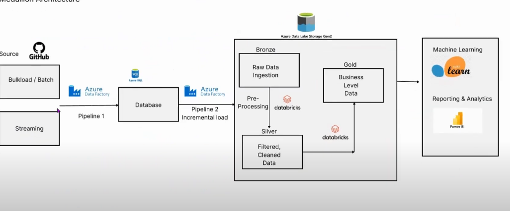
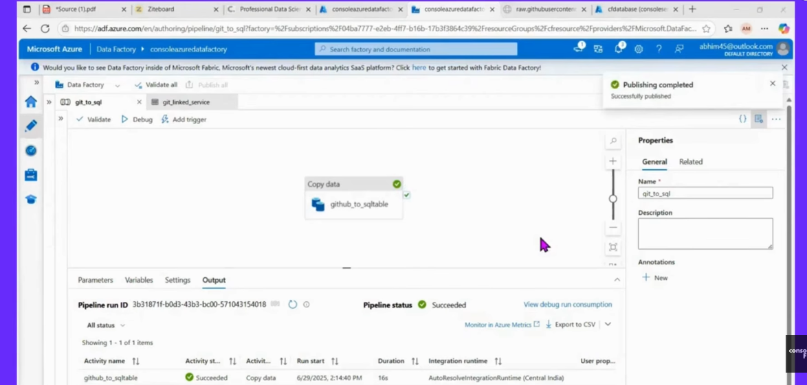
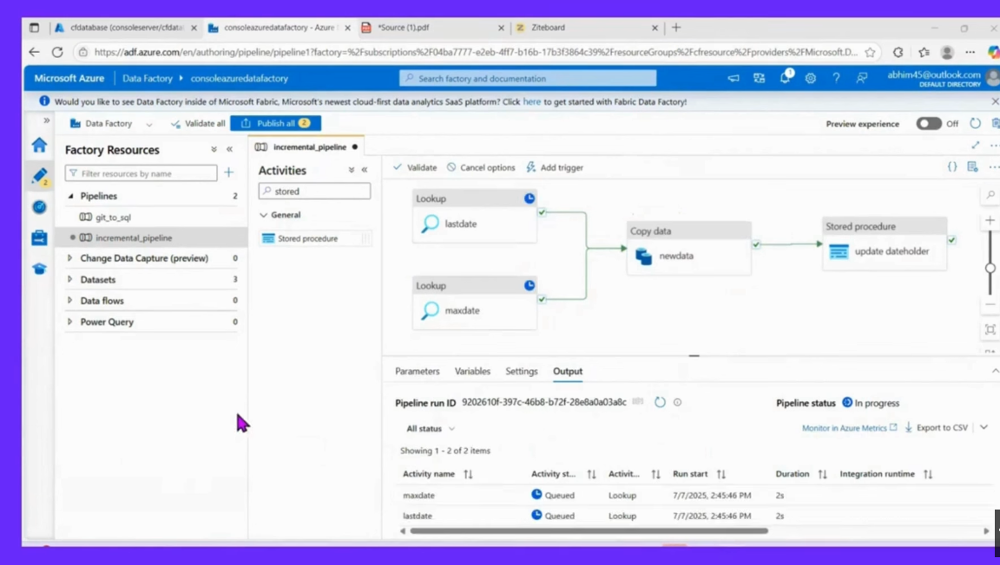
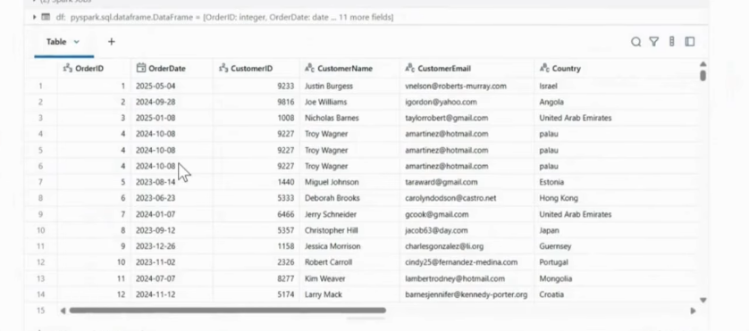
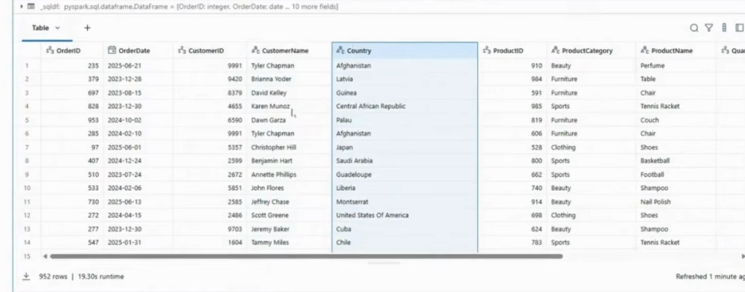

# 🚀 End-to-End Azure Data Engineering Project

🚀 Built a scalable data pipeline to process raw data into clean and structured data using the Azure ecosystem.

---

## 📌 Project Summary
This project demonstrates a real-world data engineering pipeline using **Medallion Architecture** (Bronze, Silver, Gold).

---

## 🏗️ Architecture
  
*Figure 1: Medallion Architecture (Bronze → Silver → Gold)*

---

## 🔄 Data Pipeline Workflow

- 📥 **Data Ingestion**: Extracted from GitHub using Azure Data Factory  
- 🟫 **Bronze Layer**: Raw data stored in Azure Data Lake  
- 🟪 **Silver Layer**: Data cleaned and transformed using Databricks (duplicates removed, nulls handled)  
- 🟨 **Gold Layer**: Business-ready structured data created using Delta Lake  

---

## 📊 Example Use Case

Processed sales/order data to:  
- Clean and standardize raw data  
- Remove duplicates  
- Prepare structured datasets for analysis  

---

## 🛠️ Tech Stack

- Azure Data Factory  
- Azure Data Lake Storage  
- Azure Databricks  
- Delta Lake  

---

## 📸 Project Screenshots

**Full Load Pipeline**  
  
*Figure 2: Full Load Pipeline using Azure Data Factory*

**Incremental Load Pipeline**  
  
*Figure 3: Incremental Load Pipeline using Azure Data Factory*

**Bronze Layer – Raw Data**  
  
*Figure 4: Raw data stored in the Bronze layer*

**Silver Layer – Cleaned Data**  
  
*Figure 5: Cleaned and transformed data in the Silver layer*

---

## 🎯 Key Learnings

- Built an **end-to-end data pipeline**  
- Implemented **Medallion Architecture**  
- Worked with **Azure Data Services**  
- Performed **data cleaning and transformation**  
